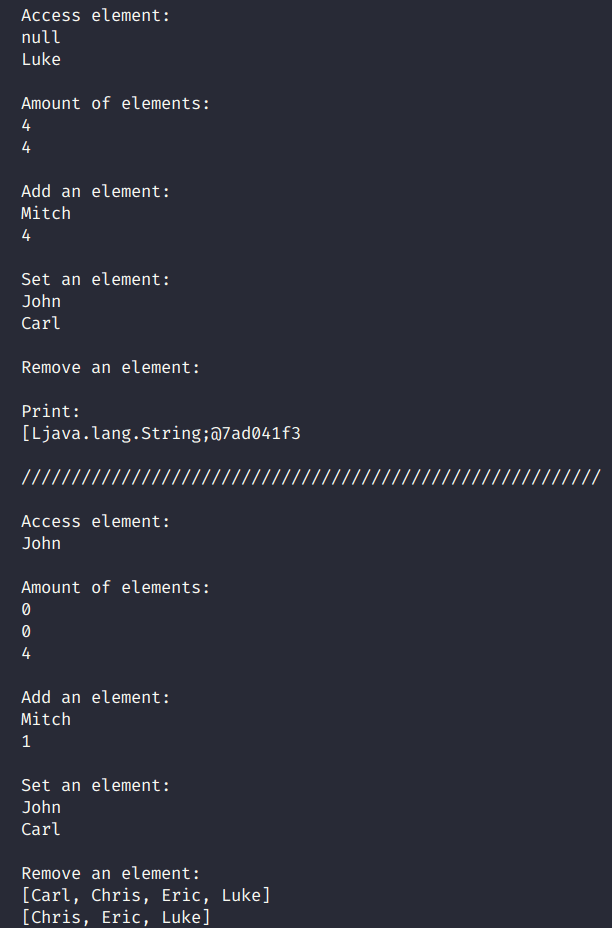

# Array Vs ArrayList

## Run code

- ### when running the code, you get the following printout:

 

 

## References

- ### Access in:

  - Youtube Channel
    - [Coding with John](https://www.youtube.com/c/CodingwithJohn)
  - Video
    - [Array vs. ArrayList in Java Tutorial - What's The Difference?](https://youtu.be/NbYgm0r7u6o)